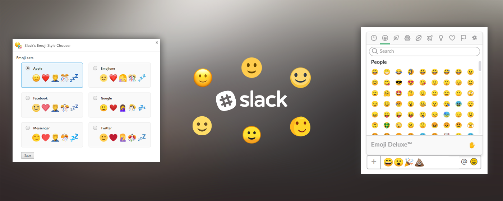

# Slack's Emoji Style Chooser (Chrome + Firefox extension)
_Do not like your emoji set on Slack? Pick one of six different Emoji styles!_

     

Starting with January 2018, Slack does no longer provide options to choose your Emoji style. See related 
[update](https://get.slack.help/hc/en-us/articles/115004846068-Slack-updates-and-changes#january-2018) announcement and
[help](https://get.slack.help/hc/en-us/articles/202931348-Emoji-and-emoticons#change-your-emoji-display).

## Published browser extensions
* [Chrome](https://chrome.google.com/webstore/detail/slacks-emoji-style-choose/ghhoeeojiokhdmaelkllggbhjnlfpbop?utm_source=github)
* [Firefox](https://addons.mozilla.org/cs/firefox/addon/slack-s-emoji-style-chooser/)

## Available emoji styles
* Apple
* Emojione
* Facebook
* Google
* Messenger
* Twitter

# Image Sources
The corresponding images (Emoji sprites) are used (linked) from [emoji-data](https://github.com/iamcal/emoji-data) project.

# Copyright
All product names, logos, and brands are property of their respective owners.

Image sources and copyright info can be found in emoji-data's [README](https://github.com/iamcal/emoji-data#image-sources).
